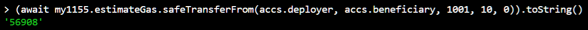
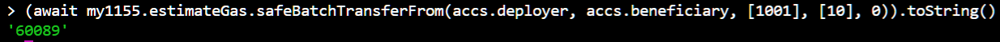

# Tech Decisions are Trade-offs


## ERC1155 safeTransferFrom vs. safeBatchTransferFrom




If you are wondering about the console. You can fire it up with hardhat and hardhat-deploy plugin if you execute the following, after the hardhat node is runnnig:

`yarn hardhat --network localhost console`

this is for verions:

```json
"hardhat": "^2.0.8",
"hardhat-deploy": "^0.7.0-beta.44",
"hardhat-deploy-ethers": "^0.3.0-beta.7",
```

### TIPS

If you are from Python background, and wondering how you can introspect things in the console. i.e. how do you do things like `__docs__`, you can execute `ethers.getContractAt.toString()` to get the function printed out to the console.

You can also tab things. For example,

```bash
ethers.
```

and then tab.

- Please use `hardhat.ethers`, though. Since it is hooked up to the deployments and you can easily pull the contracts required by name, as well as accounts, if you have named them in your `hardhat.config.ts`
